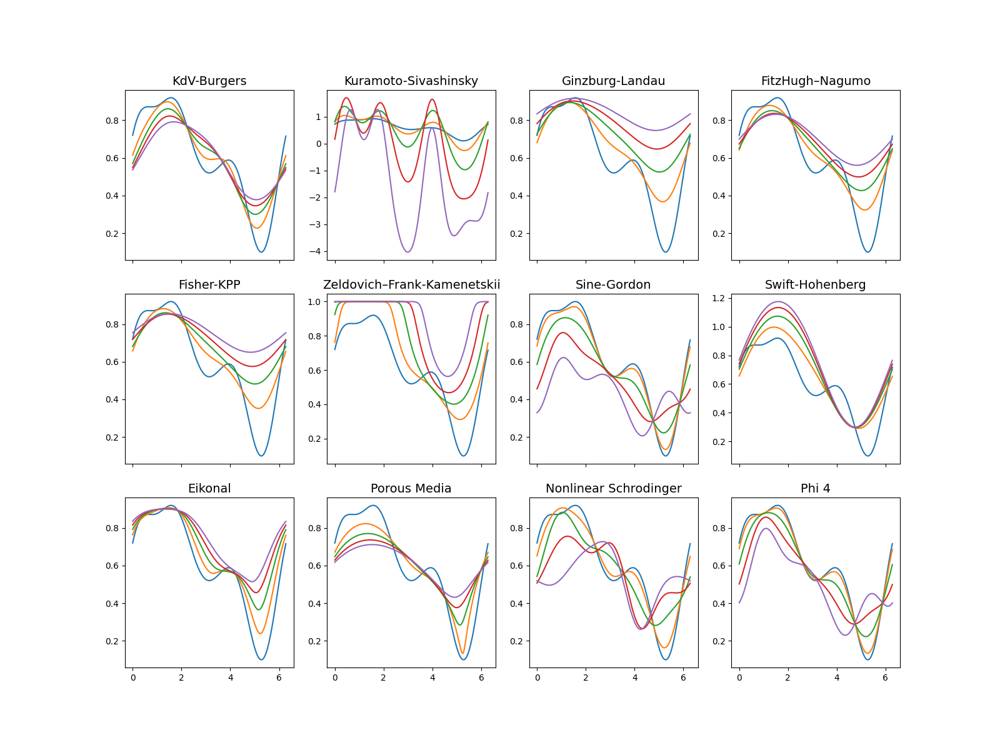

# PDE Identification

Repository for **PDE Identification** with partial solution data.

- [x] Solution generation
- [ ] Identification

## Experiment Requirements (Conda)
```bash
apt-get install build-essential
apt-get install libfftw3-dev

conda create -n pde python=3.9
pip install -r requirements.txt
python setup.py build_ext -b utilities
conda install -c conda-forge libstdcxx-ng --update-deps 
```

## Tests
```bash
python runtests.py
```

```bash
python -m unittest discover -s tests -p '*test.py'
```

# Examples



